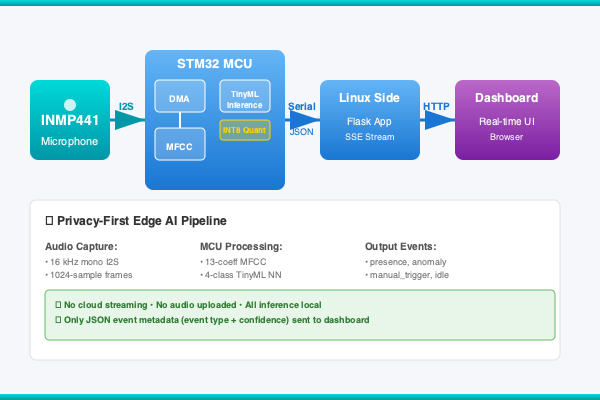

# Edge AI Smart Security Hub

> Privacy-first acoustic event detection at the edge — Arduino UNO Q + INMP441 + TinyML

 <!-- placeholder -->

A home security node that detects acoustic events (`presence`, `anomaly`, `manual_trigger`)
using on-device TinyML inference. No cloud. No audio streaming. Fully private.

## Hardware
- Arduino UNO Q
- INMP441 I2S MEMS microphone
- Dupont jumper wires

## Quick Start

### 1. Wire the hardware
See [01_hardware_setup/WIRING.md](../01_hardware_setup/WIRING.md)

### 2. Train the AI model
See [03_ai_model/EDGE_IMPULSE_SETUP.md](../03_ai_model/EDGE_IMPULSE_SETUP.md)

### 3. Flash the firmware
See [04_firmware_inference/README.md](../04_firmware_inference/README.md)

### 4. Deploy firmware + app (recommended)
```bash
bash scripts/setup.sh
./deploy.sh all
```
Open http://<board-ip>:7000

For the full device flow, use `bash scripts/cycle.sh` from the repository root.

## Automated deploy/test cycle (repo root)

```bash
./deploy.sh all         # flash main firmware + deploy app
./deploy.sh test        # bridge transport test + restore main firmware/app + health checks
./deploy.sh cycle       # full deploy + test in one command
./deploy.sh bridge-test # isolated Bridge WAV test (auto-restores main deployment)
```

Dashboard/API endpoint: `http://<board-ip>:7000`

## Architecture

```text
INMP441 ──I2S──► MCU (STM32)
                  │ DMA Buffer
                  ▼
            Edge Impulse MFCC
                  │
                  ▼
            TinyML NN Inference
                  │ Serial1 JSON
                  ▼
            Linux (UNO Q)
                  │ Flask SSE
                  ▼
            Browser Dashboard
```

## Event Classes
| Event | Trigger | Dashboard Color |
|-------|---------|----------------|
| presence | Footsteps, voices | 🟡 Amber |
| anomaly | Loud crash, bang | 🔴 Red |
| manual_trigger | Triple clap | 🔵 Blue |
| idle | Silence | 🟢 Green |

## Project Structure

| Directory | Purpose |
|---|---|
| `01_hardware_setup/` | INMP441 wiring, schematic, checklist |
| `02_firmware_audio/` | I2S DMA audio capture backend |
| `03_ai_model/` | Edge Impulse training pipeline and export notes |
| `app/` | **Primary runtime path** (`app/sketch` firmware + `app/python` Linux app on port 7000) |
| `04_firmware_inference/` | Legacy/reference inference docs and earlier flow |
| `05_linux_dashboard/` | Legacy/reference dashboard docs and earlier flow |
| `06_integration/` | IPC specification, test plan, troubleshooting |
| `07_submission/` | Hackster article, BOM, demo script, submission assets |
| `DECISIONS.md` | Architecture decisions and rationale |

## License
MIT
